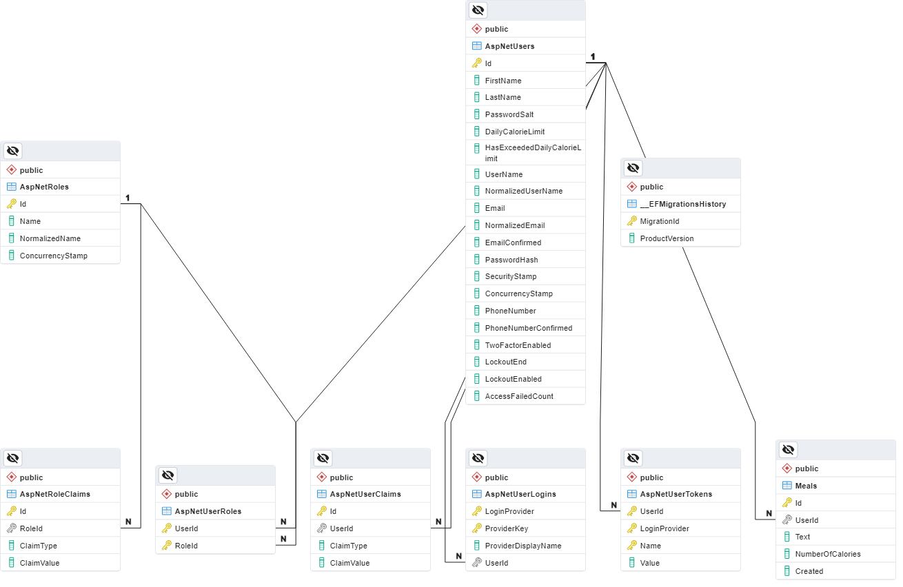
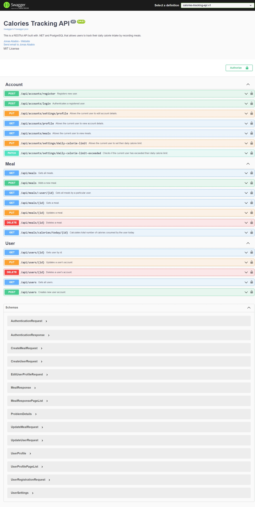

# Calories Tracking API

> This is a RESTful API built with .NET and PostgreSQL that allows users to track their daily calorie intake by recording meals.

## Features

- Authentication with JWT
- Basic user account operations including setting daily calorie limit
- User and meal CRUD opeartions
- Pagination and filtering where necessary

## Database Model

The database includes tables that manage user-related data such as accounts, roles, authentication tokens, meals, etc.



## Frameworks and Libraries

The API uses the following libraries and frameworks to deliver various functionalities:

- .NET 7
- Entity Framework Core 7.0.10 (with PostgreSQL)

## Configuration

To run the project, add configurations to `appsettings.json` in the presentation layer. For integration testing, add a `secret.json` file to the tests project with the necesaary configurations.

```
{
    "nutritionix-api": {
        "application-id": "{provide-id}",
        "application-key": "{provide-key}"
    },
    "Authentication": {
        "Schemes": {
            "Bearer":
            {
                "issuer": "calories-tracking-api",
                "audience": "{audience}",
                "secret-key": "{secret-key}"
            }
        }
    },
    "ConnectionStrings": {
        "default": "Host=...;Username=...;Password=...;Database=...;"
    },
    "Identity": {
        "Administrator": {
            "FirstName": "John",
            "LastName": "Snow",
            "Username": "crow_lord",
            "Email": "bastard@thewall.com",
            "Password": "www.winT3rf3II.com"
        },
        "RegularUser": {
            "FirstName": "Julius",
            "LastName": "Pepperwood",
            "Username": "julius.pepperwood",
            "Email": "jp@theloft.com",
            "Password": "Sweatyback1234!"
        },
        "UserManager": {
            "FirstName": "Micheal",
            "LastName": "Scott",
            "Username": "mj.scott",
            "Email": "manager@calories-tracker.com",
            "Password": "ilOv3ho,y"
        }
    }
}
```

## API Documanetation

`/swagger`



### Contributing

Contributions are welcome! If you have any suggestions, bug reports, or feature requests , please open an issue or submit a pull request.

### License

This project is licensed under the MIT License. See the `LICENSE` file for details. 